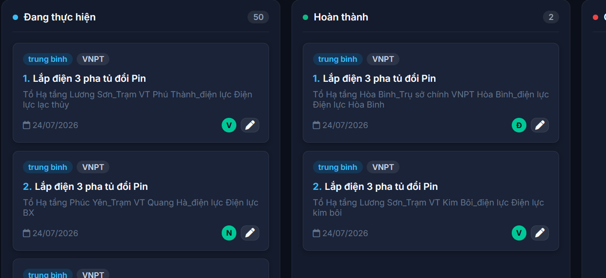

# 🚀 Task Management Web App (Quản Lý Công Việc & Hồ Sơ VNPT)

Ứng dụng Web Quản lý Công việc, Hồ sơ & Nhân sự hoàn chỉnh, tối ưu hóa giao diện Single Page Application (SPA) với backend **Google Apps Script & Google Sheets**, giao diện gradient hiện đại **Electric Indigo**, hỗ trợ 3 chế độ xem (Kanban Board Drag & Drop, Danh sách chi tiết, Biểu đồ Gantt Chart).

---

## 📌 1. CẤU TRÚC MÃ NGUỒN (FILES OUTPUT)

| Tệp tin                         | Mô tả                                                                                                                                                |
| :------------------------------- | :----------------------------------------------------------------------------------------------------------------------------------------------------- |
| `Code.gs`                      | Mã nguồn Backend Google Apps Script xử lý ORM Google Sheets, Caching (`CacheService`), Tự động kiểm tra quá hạn, API `doGet`/`doPost`. |
| `index.html`                   | Cấu trúc HTML5 SPA chính (Headers, Navigation, Filters, Views, Modals).                                                                             |
| `styles.css` / `CSS.html`    | Thiết kế giao diện Glassmorphism, Gradient Electric Indigo, Responsive, Kanban & Gantt CSS.                                                         |
| `app.js` / `JavaScript.html` | Logic Frontend (Render UI, Drag & Drop, Gantt Chart Timeline, Tính % tiến độ Subtasks tự động, Filters, Modals CRUD).                           |
| `vercel.json`                  | Cấu hình cho việc Deploy ứng dụng lên Vercel.                                                                                                    |
| `README.md`                    | Hướng dẫn cài đặt và Triển khai (GAS & Vercel).                                                                                                |

---

## 📊 2. CẤU TRÚC DỮ LIỆU GOOGLE SHEETS

Cơ sở dữ liệu tự động khởi tạo trên Google Sheet `13ggsO-iGlpspavwuBk8g6ZmAqcRsOmE8dZZZl8t_oLE` với 4 bảng:

1. **`congviec`**: `ID`, `Tiêu đề`, `Mô tả`, `Trạng thái`, `Mức độ ưu tiên`, `Ngày bắt đầu`, `Ngày kết thúc`, `Tiến độ (%)`, `Người thực hiện`, `Danh sách công việc con`, `Tệp đính kèm`.
2. **`Users`**: `ID`, `Tên`, `Tổ`.
3. **`cvluuy`**: `ID`, `Công việc`, `Mô tả`, `Tổ`, `Ngày bắt đầu`, `Ngày kết thúc`, `Ngày làm xong`, `Trạng thái`, `Ghi chú`.
4. **`Documents`**: `ID`, `Số hồ sơ`, `Tên hồ sơ`, `Danh mục`, `Phòng ban`, `Ngày ban hành`, `Ngày kết thúc`, `Dự án`, `Nhà cung cấp`, `Tình trạng`, `Giá trị HĐ`, `Giá trị thực hiện`, `Chênh lệch`, `File Name`, `File URL`, `Mô tả`, `Ngày tạo`.

---

## 🛠️ 3. HƯỚNG DẪN TRIỂN KHAI TRÊN GOOGLE APPS SCRIPT (GAS)

1. Mở trang [Google Apps Script](https://script.google.com/) và tạo **Dự án mới (New Project)**.
2. Tạo các tệp tin trong dự án Apps Script theo đúng tên sau:
   - `Code.gs` (Code file): Copy toàn bộ nội dung tệp `Code.gs`.
   - `index.html` (HTML file): Copy toàn bộ nội dung tệp `index.html`.
   - `CSS.html` (HTML file): Copy toàn bộ nội dung tệp `CSS.html`.
   - `JavaScript.html` (HTML file): Copy toàn bộ nội dung tệp `JavaScript.html`.
3. Nhấn vào nút **Triển khai (Deploy)** ở góc trên bên phải ➔ Chọn **Tạo bản triển khai mới (New deployment)**.
4. Cấu hình bản triển khai:
   - **Loại triển khai (Select type)**: Chọn biểu tượng bánh răng ➔ **Ứng dụng web (Web app)**.
   - **Mô tả (Description)**: *Task Management Web App v1.0*.
   - **Thực thi dưới dạng (Execute as)**: Chọn **Tôi (Me / email của bạn)**.
   - **Ai có quyền truy cập (Who has access)**: Chọn **Bất kỳ ai (Anyone)**.
5. Nhấn **Triển khai (Deploy)** ➔ **Cấp quyền truy cập (Authorize Access)** chọn tài khoản Google của bạn ➔ **Nâng cao (Advanced)** ➔ **Đi tới dự án (Unsafe)** ➔ Nhấn **Cho phép (Allow)**.
6. Sao chép **URL ứng dụng web (Web App URL)** (dạng `https://script.google.com/macros/s/.../exec`).

---

## 🌐 4. HƯỚNG DẪN ĐẨY LÊN GITHUB & DEPLOY VERCEL

### Lệnh đẩy mã nguồn lên GitHub Repo (`https://github.com/ttkdvp-prog/congviectuan`):

```bash
git init
git add .
git commit -m "Initial commit for Task Management Web App"
git branch -M main
git remote add origin https://github.com/ttkdvp-prog/congviectuan.git
git push -u origin main --force
```

### Deploy lên Vercel:

1. Đăng nhập vào [Vercel.com](https://vercel.com).
2. Nhấn **Add New...** ➔ **Project** ➔ Chọn Repository `ttkdvp-prog/congviectuan`.
3. Giữ nguyên cấu hình mặc định (Root Directory `./`) và nhấn **Deploy**.
4. Khi ứng dụng Vercel khởi chạy, mở ứng dụng ➔ Nhấn vào nút **Cấu hình API** trên góc phải màn hình ➔ Dán đường dẫn **Web App URL của Google Apps Script** đã lấy ở Bước 3.6 để đồng bộ cơ sở dữ liệu!
